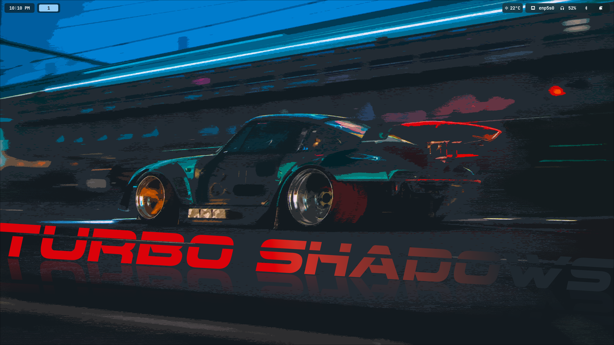

# ❄️ NixOS "Glassy" Hyprland Config

A modern, translucent Hyprland configuration for NixOS, featuring dynamic wallpaper-based theming and a "Control Center" dashboard style.

## ✨ Features

* **Dynamic Theming:** Powered by **Matugen**. Colors for the bar, launcher, and notifications are automatically generated from the current wallpaper.
* **Glassy Waybar:**
    * Clean Design
    * Hover for detailed stats (IP, Volume %, Time remaining).
* **Custom Dashboard (SwayNC):**
    * Integrated media controls, volume/brightness sliders, and system toggles.
* **App Grid (Rofi):**
    * 4-row grid layout with file browser integration.
* **Power Menu (Wlogout):**
    * Horizontal layout with smooth CSS scaling animations.
    * Frosted glass background with fade-in effects.

## 🛠️ Tech Stack

* **OS:** NixOS (Flakes + Home Manager)
* **WM:** Hyprland
* **Bar:** Waybar
* **Launcher:** Rofi
* **Notifications:** SwayNotificationCenter
* **Terminal:** Kitty
* **Shell:** Fish Shell
* **Font:** JetBrainsMono Nerd Font

## ⌨️ Key Customizations

| Component | Action | Description |
| :--- | :--- | :--- |
| **Waybar** | Hover Battery | Shows time remaining & battery health. |
| **Waybar** | Click Modules | Toggles between Icon view and Text view (%). |
| **Dashboard** | `Super` + `H` (or click bell) | Opens the SwayNC Control Center. |
| **Theme** | `theme-switcher <image>` or `Super` + `G`| Updates wallpaper and recolors all UI components. |

## 📜 Scripts

* **`weather.sh`**: Fetches weather from `wttr.in` with a retry mechanism to prevent empty icons.
* **`theme-switcher.sh`**: Updates the wallpaper, runs Matugen, and reloads Waybar/SwayNC/Hyprland instantly.